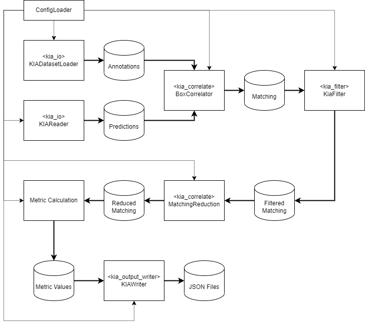

# Metric Benchmarking Tool

The Metric Benchmarking Tool (MBT) is an application to perform standard
benchmarks using the KI Absicherung (KIA) dataset for 2D object detection. It is meant
to allow evaluations of the effectiveness of different methods, by comparing
the results calculated by this tool using defined metrics.

## Introduction

The MBT requires the KIA dataset, which already has applied the fixes and
enrichment script for additional meta information. Also it is assumed, the
prediction results from the method are compliant with the output format specification.

Figure 1 shows the workflow of the MBT.



**Fig. 1**: Workflow of the MBT. Note that descriptions in angle brackets are the names of the modules of the MBT.

The workflow starts by reading a configuration file, that contains all necessary information to execute the tool. Please see the section about the configuration file to customize and adjust it to your needs and setting. The `ConfigLoader` reads the configuration file and splits the configuration for the different processing steps.

After configuration loading, the annotations and predictions are loaded by the `KIADatasetLoader` and `KIAReader`, respectively. Note that only 2D bounding box annotations and predictions are loaded including available enriched meta information. Finally, two dataframes are created that contain the information of the annotations and predictions.

In the next step, the `BoxCorrelator` takes the annotations and predictions and performs a correlation between them per sample, which results in a matching dataframe. The matching is basically done by specified `IoU` threshold. Note that in the default configuration a n-to-m matching is performed.

After correlation, the filter module `KiaFilter` takes the annotation, prediction and matching dataframe to filter them according to specified filter rules, which can be configured in the configuration file. The result is a filtered matching dataframe, which is then forwarded to a reduction step (`MatchingReduction`), where the matching is reduced from a n-to-m matching to a 1-to-1 matching. This is required for most of the metrics.

The next steps perform the actual metric calculation. Based on the configuration, different metrics are calculated and stored into a result dataframe, which then contains the metric values along with the name and identifier of the metric.

Finally, the `KIAWriter` takes the result dataframe and writes JSON files according to the TP1/TP3 output format to disk.

## Installation, Releases and Reporting

- *Installation*: The MBT tool can be installed by following the [installation steps](INSTALL.md).
- *Releases*: The documentation of the releases can be found [here](CHANGELOG.md).
- *Reporting*: If you experience any bugs/issues or if you have requests on additional features, please start an issue.

## Configuration File

The MBT uses a single configuration file to configure the different modules and steps described in the introduction section. The configuration file is a JSON file, with the following general structure:

```json
{
    "io": {},
    "correlate": {},
    "filter": {
        "annotation_filter": {},
        "prediction_filter": {},
        "matching_filter": {}
    },
    "metrics": {},
    "writer": {},
}
```

In the following we will go through each module configuration.

### IO configuration

The IO module configuration is responsible for configuring the loading of the annotations and predictions. Here is an example of a valid configuration for loading the data from the file system:

```json
"io": {
    "data_path": "/mnt/share/kia/data",
    "predictions_path": "/mnt/share/kia",
    "results_folder": "Opel-SSD-r3-v2",
    "backend": "fs",
    "sequences": [
        "mv_results_sequence_0064_224b973925d84f208a377fda185d842f",
        "bit_results_sequence_0174-54c7c84860b442eca995b153754b8c37"
    ]
}
```

- *data_path*: The data path specifies the absolute path to the root folder, in which the sequence folders are located.
- *predictions_path*: The prediction path is the absolute path to the root folder, where the `predictions` folder is located. In general, the folder structure for the predictions is assumed to be `<predictions_path>/predictions/<results_folder>`.
- *results_folder*: The name of the results folder, e.g. `Opel-SSD-r3-v2`.
- *backend*: The backend that shall be used for loading the data. Currently two backends are supported, the file system `fs` and MinIO `minio` backend.
- *sequences*: Contains a list of sequence folders that shall be loaded. Note that when this list is empty, the official test sequences are loaded automatically, if available.

As mentioned before, there is also a backend for loading the data from a MinIO server. If the MinIO backend shall be used, additional configuration is required. First, the access and secret key needs to be set by using the following environment variables:

- `KIA_MBT_MINIO_ACCESS_KEY`: Access key
- `KIA_MBT_MINIO_SECRET_KEY`: Secret key

Second, the following configuration needs to be done in the configuration file:

```json
"io": {
    //...
    "minio_endpoint": "endpoint",
    "minio_bucket": "bucket_name",
    "minio_use_proxy": true
}
```

- *minio_endpoint*: The endpoint of the MinIO service.
- *minio_bucket*: The name of the bucket, where the data is located.
- *minio_use_proxy*: If set to `true`, the environment variable `https_proxy` is used to configure a proxy for the MinIO client.

### Correlate configuration

The correlate configuration supplies the correlation module with parameters on how to perform the bounding box correlation. An example of a valid configuration for this module looks like the following:

```json
"correlate": {
    "iou_threshold": 0.5,
    "matching_type": "complete",
    "clip_truncated_boxes": true,
    "optional_arguments:": {
        "confidence_col": "confidence",
        "annotation_bb_center_col": "center",
        "annotation_bb_size_col": "size",
        "detection_bb_center_col": "center",
        "detection_bb_size_col": "size"
    }
}
```

- *iou_threshold*: The `IoU` threshold above which a prediction is assigned to an annotation. **Value can range from** `[0.,1.]`**, but has to be set to the smallest value, that will be required for metric calculations (e.g. mAP) later-on**. 
- *matching_type*: The matching type can be `complete` or `exclusive`. Thereby, `complete` means that a n-to-m matching is performed and `exclusive` performs a 1-to-1 matching.
- *clip_truncated_boxes*: If set to `true`, 2D bounding box annotations that reach over the image border will be clipped so that they are only within the image. Helps to match and filter out truncated bounding boxes.
- *optional_arguments*: A dictionary containing optional arguments to configure the names of the columns that shall be used for the correlation. Default parameters are given in the example.

### Filter configuration

The filter configuration contains user-specific filter descriptions for filtering annotations, predictions and the matching. A filter description contains four elements:

- The *name* of the filter which can be chosen arbitrarily
- The *column* which shall be filters
- An *operator* that compares the column to a value
- And of course the *value* itself

A valid filter description looks like the following:

```json
"within_brake_dist_30kph == True": [
    "within_brake_dist_30kph",
    "==",
    true
]
```

If the column you specified contains lists or tuples, you can use bracket notation to access and filter a single component, e.g. for the width in the bounding box size use `size[0]`. Be aware that you can not use brackets in regular column names to avoid ambiguity.
Note: the following operators are currently supported: `==`, `!=`, `>`, `>=`, `<`, `<=`, `in`, `not_in`. A valid configuration for the filter module would look like the following:

```json
"filter": {
    "annotation_filter": {
        "class_id == human": [
            "class_id",
            "==",
            "human"
        ],
        "occlusion_est < 0.8": [
            "occlusion_est",
            "<",
            0.8
        ],
        "within_brake_dist_30kph == True": [
            "within_brake_dist_30kph",
            "==",
            true
        ],
        "semantic_area in ['road', 'crossing', 'sidewalk']": [
            "semantic_area",
            "in",
            [
                "road",
                "crossing",
                "sidewalk"
            ],
        ],
        "size[0] > 33px": [
                "size[0]",
                ">",
                33
        ]
    },
    "prediction_filter": {},
    "matching_filter": {}
}
```

### Metric configurations

The metric configuration allows to customize specific metric parameters and to select which metrics shall be calculated. A valid configuration looks like the following:

```json
"metrics": {
    "calculate": [
        1027,
        1028,
        1031
    ],
    "parameters": {
        "1031": {
            "calculate_per_class": true,
        }
    }
}
```

- *calculate*: List of metric identifiers, specifying which metrics shall be calculated. You might want to use the option `--list_metrics` to see all available metrics. The metric identifiers are according to the KIA metric catalogue.
- *parameters*: Each metric can have optional arguments to configure how the metric is calculated. In order to configure the parameters for one metric, the respective ID must be the key in the parameters dictionary followed by the dedicated metric parameters. The parameters for each metric can be found in the respective `MetricProcessor` documentation.

### Output Writer Configuration

The output writer configuration has options to configure the writing of the result JSON files containing the metric values. The configuration for this module looks like the following:

```json
"writer": {
    "version_file": "version.json",
    "output_path": "/mnt/share/kia"
}
```

- *version_file*: File that contains the version information of the MBT to generate output file headers. Please do not change the file.
- *output_path*: Root path were the result JSON files will be written to. Note that the resulting folder structure will be like `<output_path>/evaluations/<result_folder>`, while `<result_folder>` is based on the configuration in the `version.json` file.

# Installation and Usage

In order to install the MBT tool, follow the steps in `INSTALL.md`.
Afterwards the tool can be started by the following command:

```bash
kia_mbt -c <config_file>
```

Thereby, `<config_file>` is the configuration file mentioned before. An example configuration file `config.json` can be found in the folder `kia_mbt` of this repository.

## Changelog

See [CHANGELOG.md](./CHANGELOG.md).

## Contributing

Main point of contact and current maintainer of this repository at Continental is [Christian Hellert](mailto:christian.hellert@continental.com).

This implementation was originally written by 
[Christian Brunner](mailto:christian.brunner@efs-auto.com),
[Tom Thielo](mailto:tom.thielo@efs-auto.com)
[Dominik Brüggemann](https://github.com/WillisChimps)
and [Christian Hellert](https://github.com/graylock).

See [CONTRIBUTING.md](./CONTRIBUTING.md).

## License

Copyright (c) 2022 Continental Corporation, Elektronische Fahrwerksysteme GmbH and Bergische Universität Wuppertal. All rights reserved.
This repository is licensed under the Apache v2.0 license. See
[LICENSE.txt](./LICENSE.txt) for the full license text.

## Acknowledgement

The research leading to these results is funded by the German Federal Ministry for Economic Affairs and Climate Action" within the project "Methoden und Maßnahmen zur Absicherung von KI basierten Wahrnehmungsfunktionen für das automatisierte Fahren (KI-Absicherung)". The authors would like to thank the consortium for the successful cooperation.
